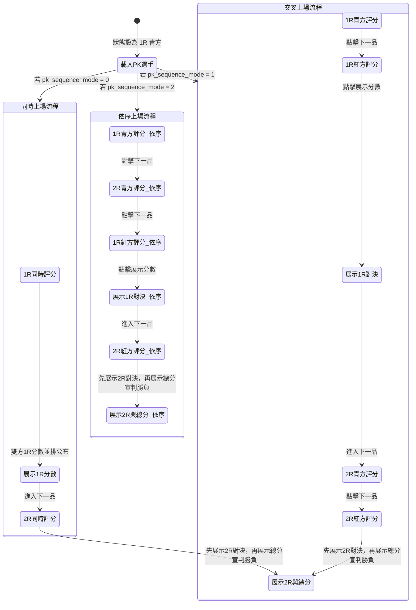

# PK 賽制全面開發執行計畫

為了完整實現「同時上場」、「交叉上場」與「依序上場」三種 PK 比賽模式，我們需要全面升級裁判打分端、主控台控制端以及大螢幕投影端。

---

## 🏆 PK 賽制比賽方式與流程規則

### 1. 同時上場 (`pk_sequence_mode === 0`)
* **比賽流程**：
  * 兩位選手（青方與紅方）同時在場上展演型場。
  * 裁判在平板專屬雙排介面上同時進行評分。
  * 1R 展演評分結束 ➡️ 大螢幕展示雙方 1R 的對決分數。
  * 2R 展演評分結束 ➡️ 大螢幕展示雙方 2R 的對決分數，再展示 1R+2R 總平均分並宣判勝負。

### 2. 交叉上場 (`pk_sequence_mode === 1`)
* **比賽流程**：
  * **1R 階段**：青色先上場展演 1R ➡️ 裁判打分（此時大螢幕不顯示） ➡️ 換紅色上場展演 1R ➡️ 裁判打分（此時大螢幕不顯示） ➡️ 雙方打完分後，大螢幕一同展示雙方 1R 分數。
  * **2R 階段**：隨後換青色上場展演 2R ➡️ 裁判打分 ➡️ 換紅色上場展演 2R ➡️ 裁判打分 ➡️ 雙方打完分後，大螢幕先展示雙方 2R 分數，最後總計 1R、2R 的總平均分並宣判勝負。

### 3. 依序上場 (`pk_sequence_mode === 2`)
* **比賽流程**：
  * **青方展演**：青色選手先上場，展演 1R 後打分，再馬上展演 2R 後打分（在此期間，大螢幕皆維持等待/準備狀態，不顯示分數）。
  * **紅方展演與 1R 揭曉**：隨後換紅色選手上場展演 1R，裁判評分完畢後，大螢幕揭曉並展示**「青方 1R 分數 vs 紅方 1R 分數」**。
  * **2R 揭曉與宣判勝負**：紅色選手接著進行 2R 展演，裁判評分完畢後，大螢幕先展示**「青方 2R 分數 vs 紅方 2R 分數」**，接著展示**「青方 1R+2R 總分 vs 紅方 1R+2R 總分」**，最後播放宣判勝負的獲勝動畫。

---

## 1. 裁判平板端 (Web App UI) 設計

當目前比賽為 PK 賽制 (`mode === 1`) 時，依據打分順序進行分流：

### 📱 方案 A：「同時上場」專用評分介面 (`pk_sequence_mode === 0`)
* **版面分割**：網頁畫面將水平均分為左右兩側。
  * **左側 (🔵 青方 - Chung)**：藍色調背景。包含青方專屬的小錯 (-0.1)、大錯 (-0.3)、退回 (Undo) 按鈕與表現力評分區（三個細分項：速度力量、節奏協調、精神表現的加減按鈕或滑桿）。
  * **右側 (🔴 紅方 - Hong)**：紅色調背景。包含紅方專屬的扣分與表現力評分區。
* **統一送出**：底部中央常駐顯示「送出評分」按鈕，點擊時同時打包青紅兩方的 Accuracy 與 Presentation 分數，一次性上傳。

### 📱 單人上場：「交叉上場」與「依序上場」介面 (`pk_sequence_mode` 為 1 或 2)
* 沿用原有的公認品勢評分面板（一次只評一人），但新增**強烈視覺提示**以防裁判打錯人：
  * **評分青方時**：網頁頂部選手卡片與背景切換為深藍色調，並顯示大字「🔵 青方 (Chung) 評分中」。
  * **評分紅方時**：網頁頂部選手卡片與背景切換為深紅色調，並顯示大字「🔴 紅方 (Hong) 評分中」。

---

## 2. 主控台控制端 (GUI Control & State Machine)

我們將在主控台引入 PK 評分狀態機，引導工作人員的操作流程：

* **主控台 UI 提示**：主畫面新增狀態標籤，顯示如 `「目前評分：🔵 青方 1R」` 或 `「目前評分：🔴 紅方 2R」`。
* **分數暫存分流**：後端會依據當前狀態，將裁判上傳的分數正確歸類存入暫存區，確保不會覆蓋。

---

## 3. 大螢幕投影端 (Projection Visuals)

PK 模式下，大螢幕不再播放單人投影片，改為三種專屬的並排分數對決畫面：

1. **PK 準備載入頁面 (PK System Ready Layout)**：
   * 左右對稱顯示 **青方選手（藍色漸層背景）** 與 **紅方選手（紅色漸層背景）** 的姓名、籤號與代表單位。
2. **PK 1R 分數對決頁面 (PK Round 1 Layout - 專屬介面)**：
   * 展示 **青方 1R 得分**（Accuracy, Presentation 平均分與 1R 最終得分）與 **紅方 1R 得分** 的並排比對。
3. **PK 2R 分數對決頁面 (PK Round 2 Layout - 專屬介面)**：
   * 展示 **青方 2R 得分**（Accuracy, Presentation 平均分與 2R 最終得分）與 **紅方 2R 得分** 的並排比對。
4. **PK 總分對決與宣判頁面 (PK Final Score Layout - 專屬介面)**：
   * 展示雙方的 1R、2R 及 **1R+2R 總平均分** 的並列對照表。
   * **宣判勝負動畫**：在此畫面中，依據總平均分判定獲勝選手（同分時依 WT 規則比對同分打破指標），獲勝那一側背景發光並跳出黃金色的 **「Chung WIN 🔵」** 或 **「🔴 Hong WIN」** 閃爍動畫，落敗方背景則變暗。

---

## 4. 變更檔案清單

### 🛠️ 全新建立的模組檔案

* #### [NEW] [projection_pk.py](file:///d:/品勢計分系統/projection_pk.py)
  * 專門封裝 PK 賽制大螢幕投影的繪製邏輯（1R、2R、總平均對決版面與 WIN 動畫）。
* #### [NEW] [pk_manager.py](file:///d:/品勢計分系統/pk_manager.py)
  * 專門實作 PK 三種比賽模式下的評分步驟與主控台按鈕流轉狀態機。

### ⚙️ 現有修改的檔案

* #### [MODIFY] [config.py](file:///d:/品勢計分系統/config.py)
  * 在 `current_state` 中擴充 PK 專屬狀態變數。
* #### [MODIFY] [templates/judge.html](file:///d:/品勢計分系統/templates/judge.html)
  * 新增同時上場專用的左右分割 HTML 結構與樣式。
* #### [MODIFY] [static/main.js](file:///d:/品勢計分系統/static/main.js)
  * 實作同時上場評分邏輯（左右扣分、數據組裝送出）與單人評分的顏色提示切換。
* #### [MODIFY] [web_server.py](file:///d:/品勢計分系統/web_server.py)
  * 實作接收「同時上場」雙份分數的 API 端點，並與 `pk_manager` 對接完成分數分流暫存。
* #### [MODIFY] [gui_main.py](file:///d:/品勢計分系統/gui_main.py)
  * 對接 `pk_manager` 狀態機，調整「準備、開始、下一品、展示分數、結束」等控制按鈕的流轉。
* #### [MODIFY] [projection.py](file:///d:/品勢計分系統/projection.py)
  * 初始化時加載 `PKProjectionRenderer`，並提供渲染 PK 介面的調用接口。

---

## 5. 驗證與測試計畫

### 1. 單元功能驗證
* 測試三種 PK 模式下，主控台的按鈕狀態流轉是否符合預期。
* 開啟多個瀏覽器視窗模擬 J1~J5 裁判，驗證：
  * 同時上場模式下，平板是否正確呈現雙排 UI，且送出後資料庫正確存入兩筆同 round 不同 side 的成績。
  * 依序/交叉上場模式下，平板是否隨主控台切換顯示正確的青紅顏色提示與評分對象。

### 2. 顯示驗證
* 驗證大螢幕在紅方 1R 評分後，是否**只展示雙方 1R 分數**。
* 驗證紅方 2R 評分後，大螢幕是否先展示 **2R 分數** ➡️ 再展示 **1R+2R 總平均分** ➡️ 最後播放 **WIN 宣判動畫**。
